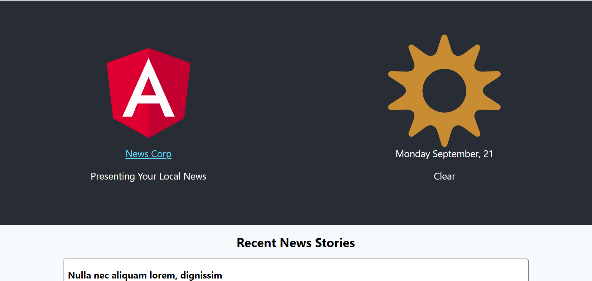

## Project Description

This is a front end application for a local news service. Currently the application consists of a single page with the branding and a summary of recent news stories. You will need to add a widget that displays information about today's weather.

You'll need to have Node >= 8.10 and npm >= 5.6 on your machine to run the application. Once you have the project cloned, from the local-news-app directory run "npm install". You can then start the application with "ng serve".

## Requirements

- You must use git for source control. You can use github, gitlab, bitbucket, or any git provider by signing up for a free account and sharing the project with us.
- You must retrieve weather information from the free [Metaweather Api](https://www.metaweather.com/api/). You can retreive the user's coordinates using the browser's [Geolocation Api](https://developer.mozilla.org/en-US/docs/Web/API/Geolocation_API). If a user chooses not to provide their location, you should default to "Philadelphia".
  - Note: The Metaweather Api may return data for mulitple locations. For this assignment you can just default to the first in the list.
- You must display the weather state provided by the api (eg. "clear", "rain", etc.).
- The widget must display an appropriate icon based on the weather state. The api provides free icons for you to use.
- The widget must display today's date formatted as "Weekday, Month Day" (e.g. "Monday, September 1").
- The widget should display nicely on a mobile device.

### Suggested Design

You may use the following suggested design:

### Notes

To avoid issues with CORS for your local development you can use [CORS-Anywhere](https://cors-anywhere.herokuapp.com/) as a proxy. Just prepend the url for your api calls with "https://cors-anywhere.herokuapp.com/" (e.g. "https://cors-anywhere.herokuapp.com/https://www.metaweather.com/api/")

When creating your widget keep in mind that this widget may be used elswhere in the application in the future.

You are free to deviate from the suggested design in any way so long as it fulfills the requirements.

You are free to add any package dependencies. There are no restrictions.

Be prepared to talk about the work you did and the choices you made.

## Submitting Your Work

When you are ready to submit your work to SofterWare be sure all changes are committed to your git repository and please do one of the following:

- Zip up your git repository, host it in cloud storage (eg. Google Drive), and share a public link with your recruiter or SofterWare.
- Push your code to your own private github repository and invite the contributor(s) of this repository to be collaborators on your private github repository. DO NOT fork this repository as this would make your work visible to other prospective candidates.
